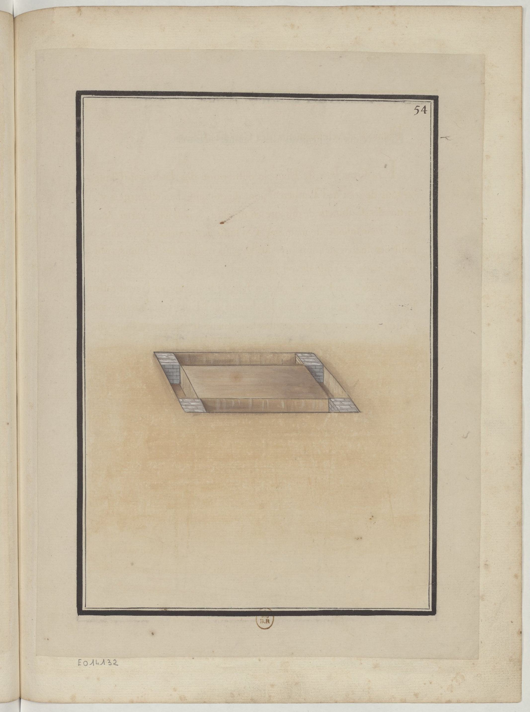
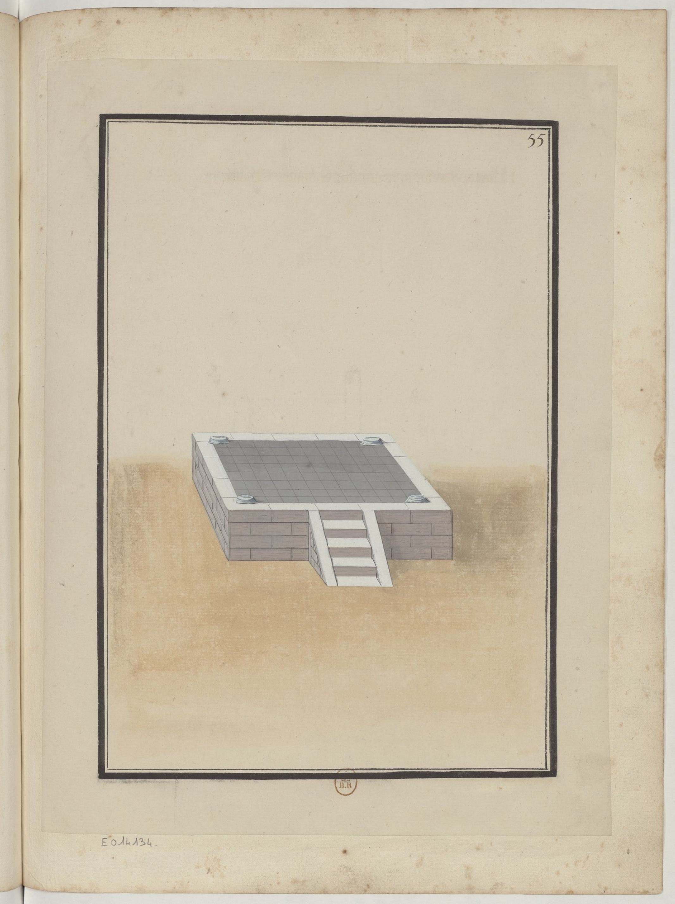
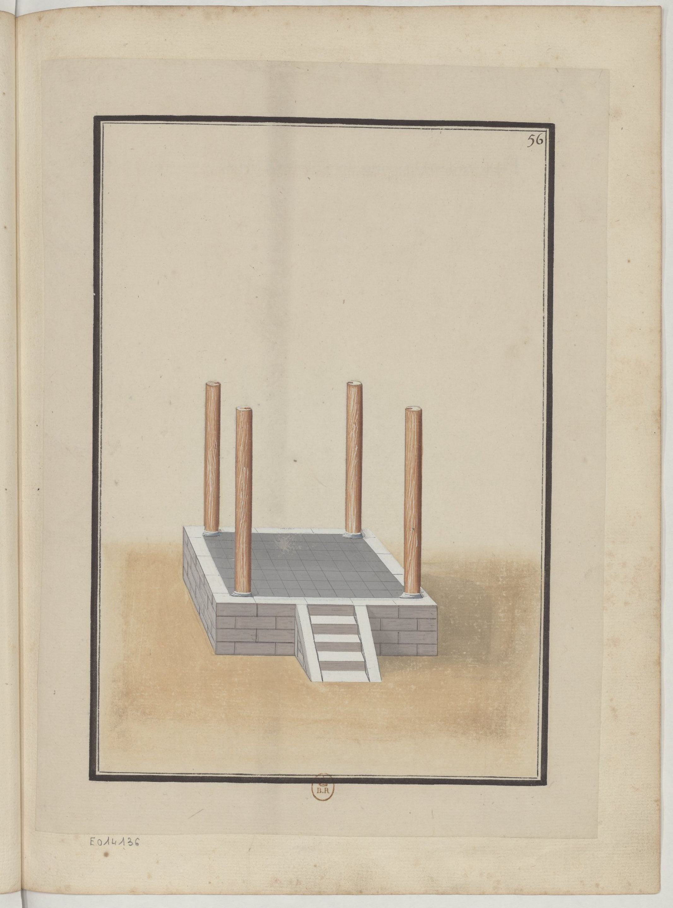
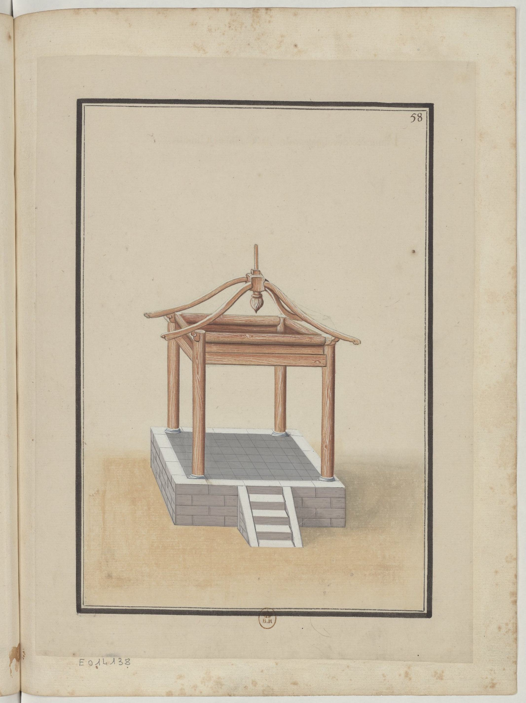
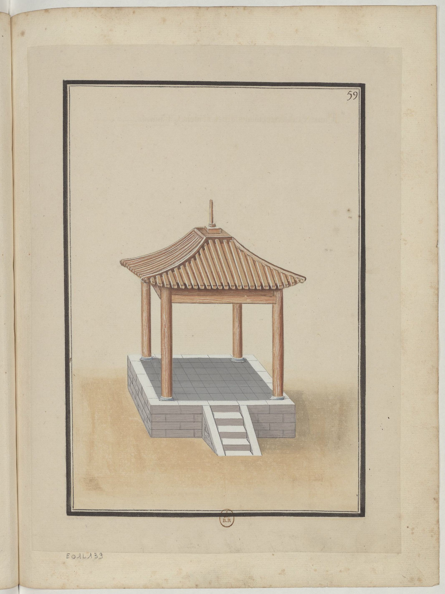
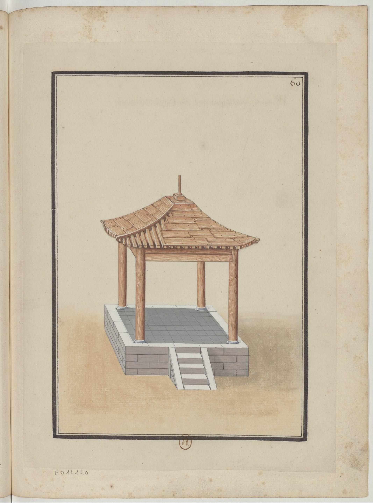
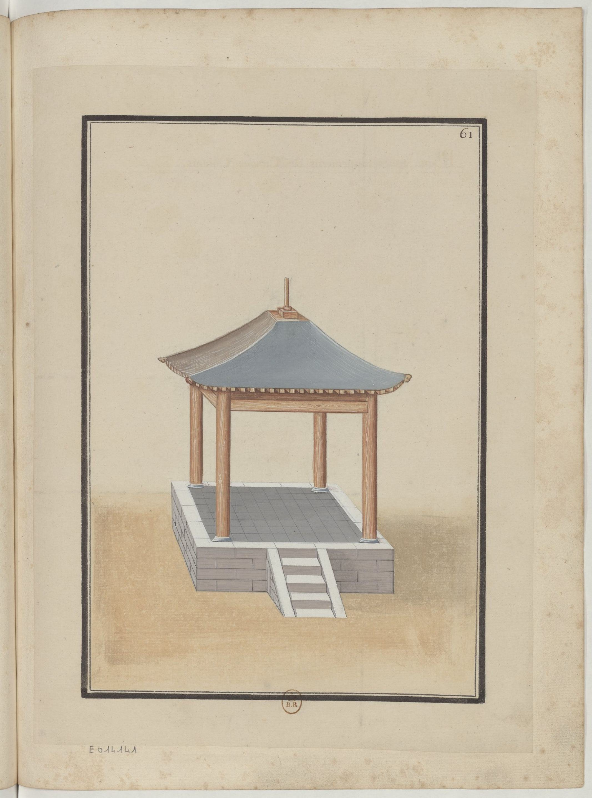
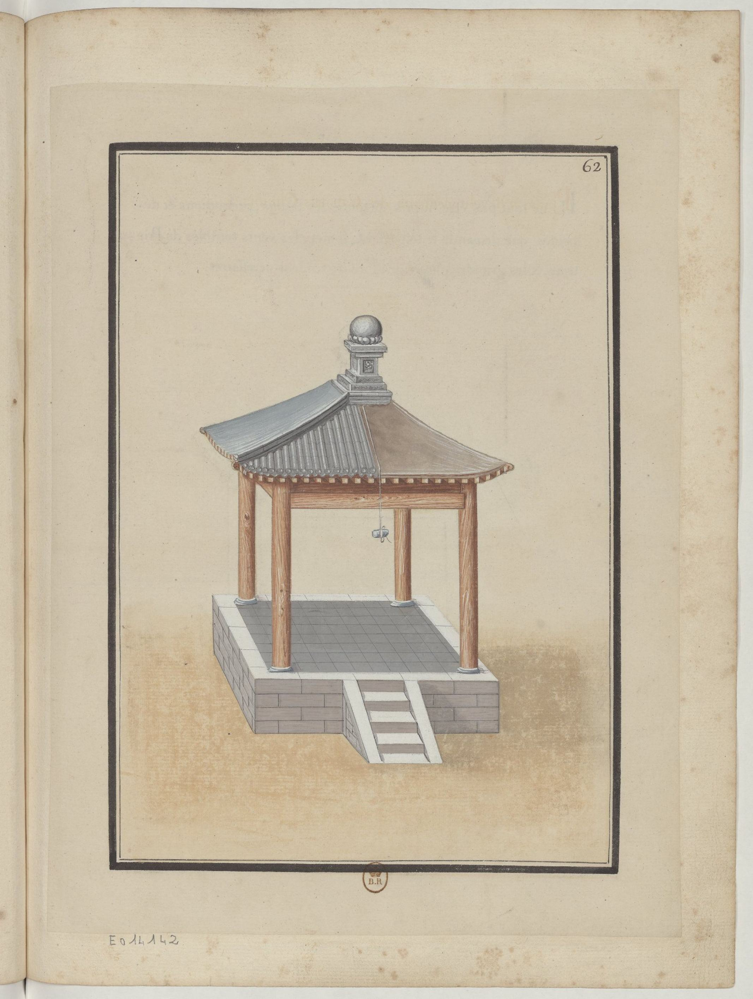
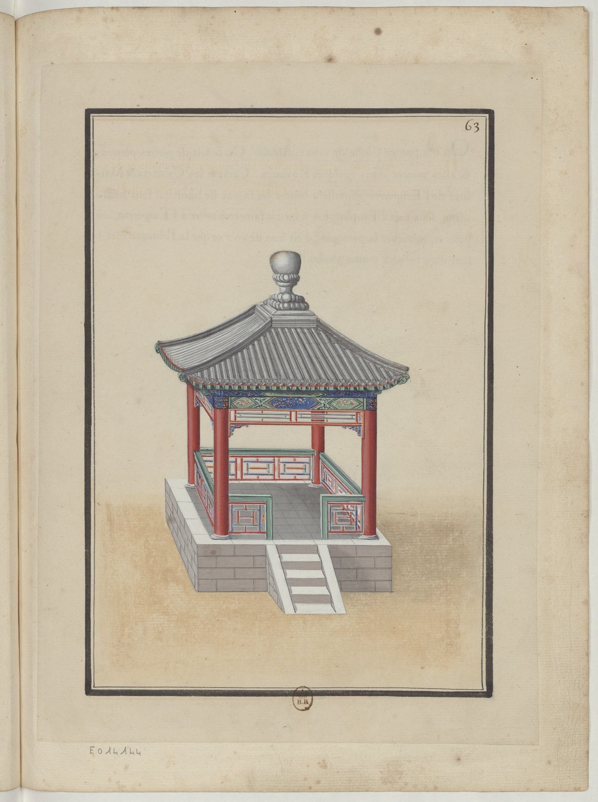

## chinese-buildings

<table>
    <tr>
        <td align="center"></td>
        <td align="center"></td>
        <td align="center"></td>
        <td align="center"></td>
        <td align="center"></td>
    </tr>
    <tr>
        <td align="center"></td>
        <td align="center"></td>
        <td align="center"></td>
        <td align="center"></td>
        <td align="center"></td>
    </tr>
</table>

Chinese buildings has attracted so many people around the world including hand painters from French. There was a book , named <[**Essai sur l'architecture chinoise**](https://gallica.bnf.fr/ark:/12148/btv1b55006437n) (中國建築彩繪筆記·工具與樣式)>, has arisen during 1800s, the author of which is still a secret, as it was almost 300 years since now. It has collected some hand paintings around Chinese buildings, and I hope to use this project to sort out all those paints into an archive with specific categories. At the same time, I am also going to translate them into English so that we can clearly know about them without knowing french.

Firstly, there is a series of images collected from the book:

- [**The Architectural Tools (建築工具)**](./tools/tools.md)
- [**The City Walls (城墻)**](./wall/wall.md)
- [**The Screen Walls (照壁)**](./screen_wall/screen_wall.md)
- [**The Cabinets (閣樓)**](./cabinets/cabinets.md)
- [**The Bridges (游橋)**](./bridges/bridges.md)
- [**The Towers (塔)**](./towers/towers.md)
- [**The Houses (房)**](./houses/houses.md)
- [**The Interiors (内室)**](./interiors/interiors.md)
- [**The "Tai" of Houses (楼台)**](./tai/tai.md)

And when it comes to the introduction of this book, we can check what the author said:

> L' Architecture Chinoise mérite t' elle d'être conniie en Europe? les connoissances qu'on pourroit donnery seroient-ellesde qulque utilité? Ce qu'on a imaginé de mieux pour répondre à ces questions a été d'envoyer un Recueil de différentes Peintures sur lesquelles on pourra suppléer à des réponses qu'on n'est pas en état de donner. Le tems n'apas permis de s'étendre autant qu'on auroit voulu sur les différentes parties du petit.

Are Chinese architectures quite famous in Europe, and is it useful to provide some knowledge around them? The best answer is those series of paints with different buildings, which has provided what we can't provide with words. Limited time has not allowed me to involve different small detailed parts. Whole book has mainly used simple nomenclature to put all images into sets. If there are somethings we need to clarify, we will enclose with some drafts, as we cannot keep all copies of contents.

> Comme on a paru bien aife de connoître un peu les Arts
  & metiers de la Chine, on a commencé ce Recueil par les instruments
  & outils du Charpentier & du Maçon qui n'estpas ici distinguédu Couvreur. Il seroit inutile d'entrer dans des détails sur ce qui parle aux yeux. On ne nommera que ce qui seroit moins aifé a reconnoitre.

Since know, we have known a little about Chinese arts and artifacts. Therefore, the book has started with architectural tools of carpenters (木匠) and masons (泥瓦匠), which are different from roofers (屋頂工)'. It has no meanings when focusing on deep detail, so we only introduce something we have seen.
