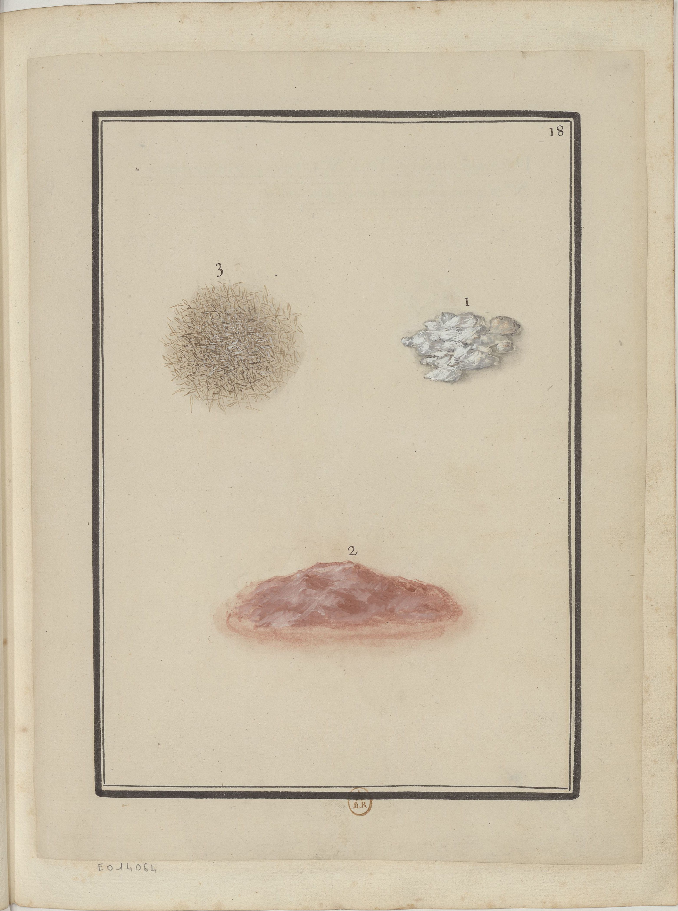

<h2 align="right"><a href="./materials.md">Back</a></h2>

    

1. White lime (石灰).

    > i. Chaux blanche.

2. Lime combined with red clay (紅土), which is used to decorate walls of palaces and temples.

    > ii. terre rouge qu'on mêle à la chaux pour crêpir les murailles du Palais des Miao &c.

4. A ball of tight mortar.

    > iii. Balle de Ris qu'on mesle dans ce mortier, est.