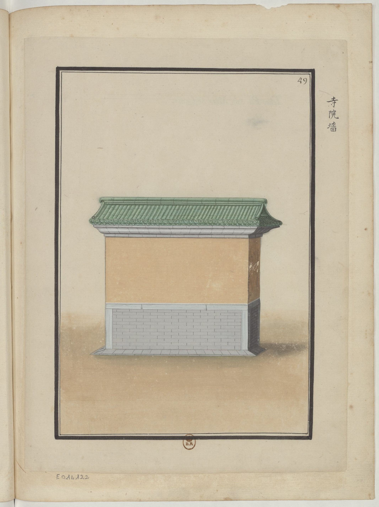

<h2 align="right">The Screen Wall (照壁) <a href="../README.md">Back</a></h2>

<table>
    <tr>
        <td align="center">
Folk wooden screen walls

民間木照屏
</td>
        <td align="center">
Screen walls of official families

官宦人家照壁
</td>
        <td align="center">
Screen walls of big families

大人家照壁
</td>
        <td align="center">
Screen walls of watchdogs and yamens

察院衙門照壁
</td>
    </tr>
    <tr>
        <td align="center"></td>
        <td align="center"></td>
        <td align="center"></td>
        <td align="center"></td>
    </tr>
    <tr>
        <td align="center">
Screen walls of ministries

部院照壁
</td>
        <td align="center">
Screen walls of governments

公府照壁
</td>
        <td align="center">
Screen walls of grandfather's houses

公爺家墻
</td>
        <td align="center">
Screen walls of temples

寺院墻
</td>
    </tr>
    <tr>
        <td align="center"></td>
        <td align="center"></td>
        <td align="center"></td>
        <td align="center"></td>
    </tr>
    <tr>
        <td align="center">
Screen walls of Lama temples

喇嘛廟照壁
</td>
        <td align="center">
Screen walls of royal temples

帝王廟照壁
</td>
        <td align="center">
Screen walls of imperial ancestral temples

太廟照壁
</td>
        <td align="center">
Screen walls of royal families

國家照壁
</td>
    </tr>
    <tr>
        <td align="center"></td>
        <td align="center"></td>
        <td align="center"></td>
        <td align="center"></td>
    </tr>
</table>

