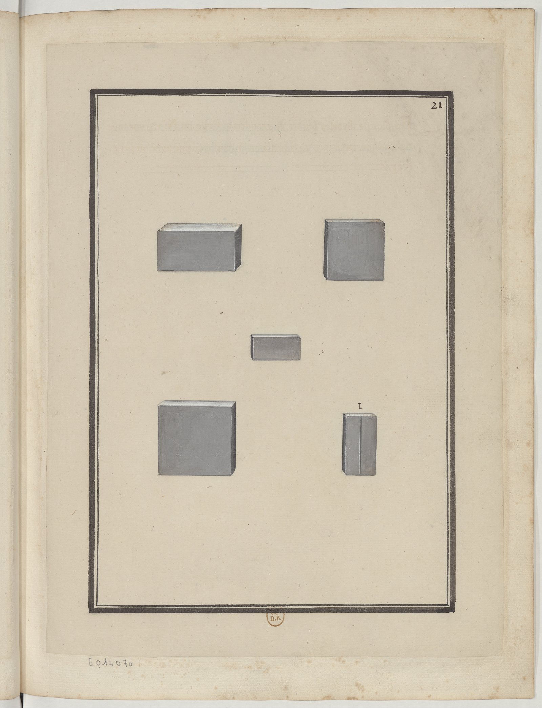

<h2 align="right"><a href="./tiles.md">Back</a></h2>

    

> Briques de diverses formes & grandeurs.

Different kinds of bricks (磚).

1. A bricks which have a groove to split into two.

    > i. a une raye ou cannelure au moyen de laquelle on la send en deux avec un petit coup.
