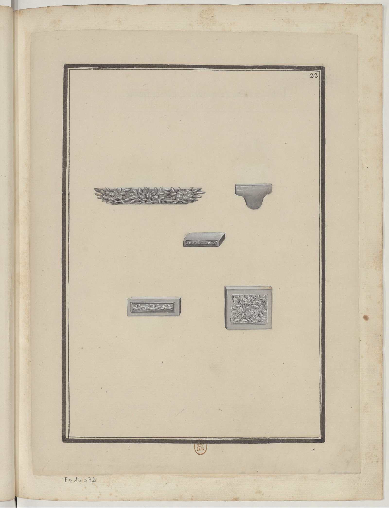

<h2 align="right"><a href="./tiles.md">Back</a></h2>

    

> Briques sculptées. Les Chinois sculptent les briques & en font des ornements &c.

Carved bricks (刻磚), carved by Chinese to act as ornaments (饰品).
