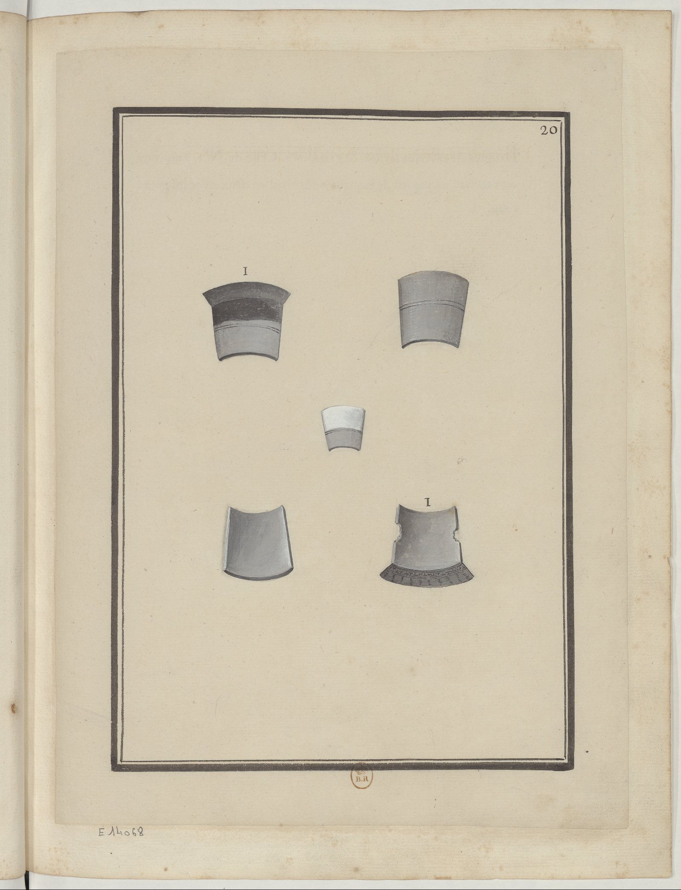
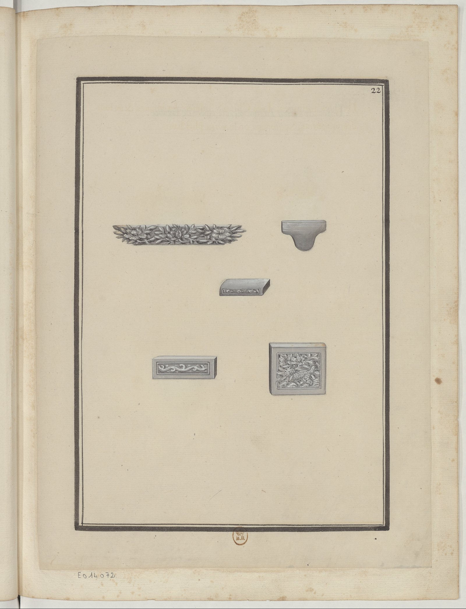

<h2 align="right">Tiles (磚瓦) <a href="../README.md">Back</a></h2>

<table>
    <tr>
        <td align="center"><a href="./1.md"><strong>Description</strong></a></td>
        <td align="center"><a href="./2.md"><strong>Description</strong></a></td>
        <td align="center"><a href="./3.md"><strong>Description</strong></a></td>
        <td align="center"><a href="./4.md"><strong>Description</strong></a></td>
    </tr>
    <tr>
        <td align="center"></td>
        <td align="center"></td>
        <td align="center"></td>
        <td align="center"></td>
    </tr>
    <tr>
        <td align="center"><a href="./5.md"><strong>Description</strong></a></td>
        <td align="center">Glazed tiles (琉璃瓦) for decorating roofs</td>
        <td align="center">Glazed tiles for decorating roofs</td>
        <td></td>
    </tr>
    <tr>
        <td align="center"></td>
        <td align="center"></td>
        <td align="center"></td>
        <td></td>
    </tr>
</table>
