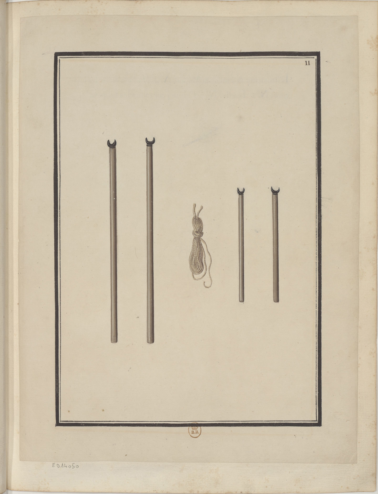

<h2 align="right"><a href="./tools.md">Back</a></h2>

    

> Appuis pour soutenir les poutres & grosses planches qu'on veut refendre.

Tools used for supporting beams (橫梁) and large boards during splitting (拆解) and installing.
