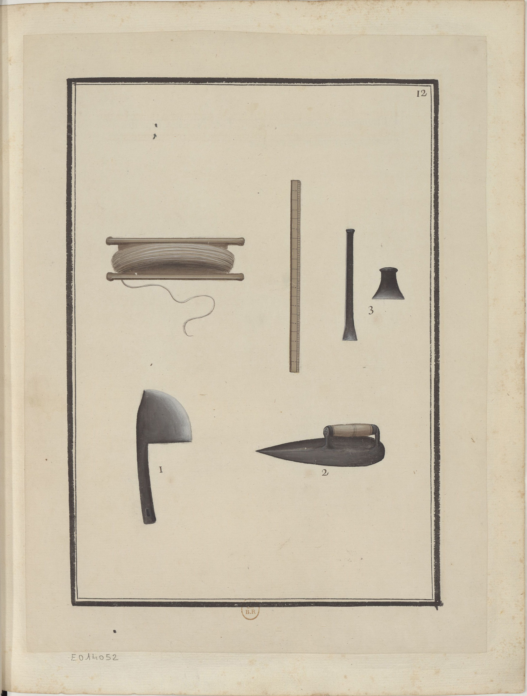

<h2 align="right"><a href="./tools.md">Back</a></h2>

    

> Instruments & outils du Maçon.

Tools of masons.

1. An ax (斧) used for cutting bricks (磚).

    > i. Hache à tailler les briques.

2. A trowel (泥抹子).

    > ii. Truelle.

3. A chisel (鑿子) for cutting bricks.

    > iii. Ciseau pour tailler les briques.
