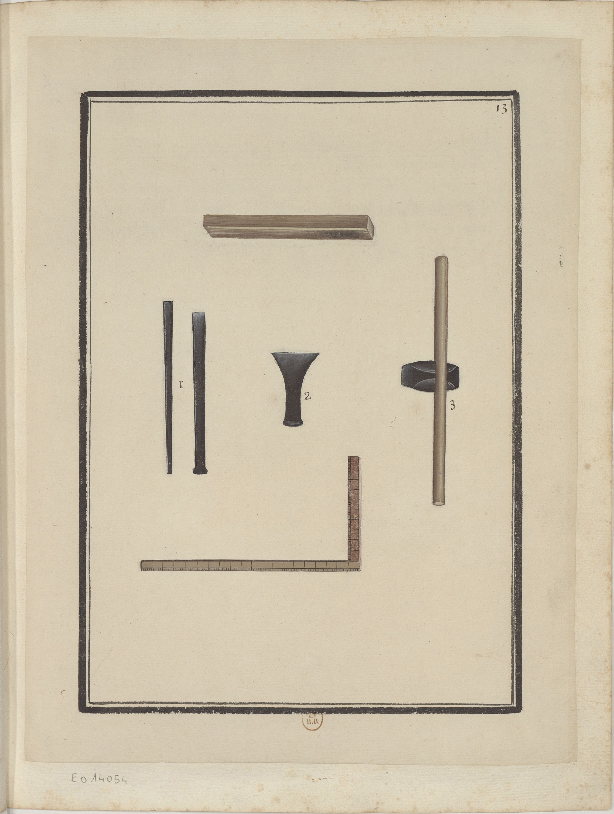

<h2 align="right"><a href="./tools.md">Back</a></h2>

    

> Instruments & outils du Maçon.

Tools of masons.

1. All three are cutters for cutting bricks (磚).

    > i. ii. iii. sont des Ciseaux pour tailler les briques.
