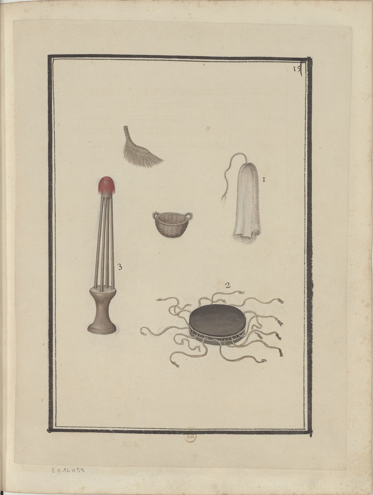

<h2 align="right"><a href="./tools.md">Back</a></h2>

    

> Instruments & outils du Maçon.

Tools of masons.

1. A kind of canvas bag filled with morta (砂漿), which can be worn on the shoulders.

    > i. est une espèce de sac de grosse toile qui se remplit de mortier & qu'on porte sur les épaules.

2. A plat of lead (鉛板) for flatting the foundations (鋪平地基) when loosened by 12 men.

    > ii. est une plaque de plomb pour baure les fondements, douze hommes l'enlevent à la fois & la laissent tomber à plat.

3. A tool used by 4 damsels flatting the foundations and roads (少女)

    > iii. Demoiselle à quatre pour baure les pavés & fondements.
