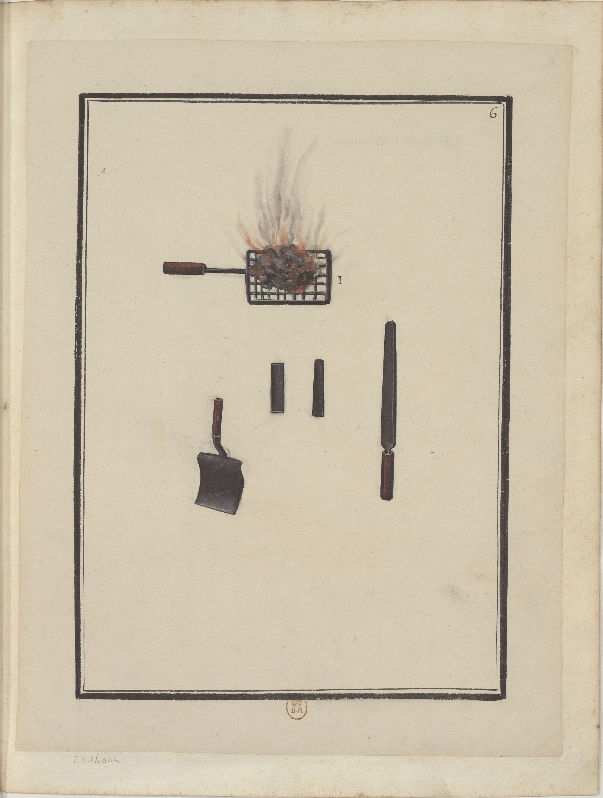

<h2 align="right"><a href="./tools.md">Back</a></h2>

    

> Outils de Charpentier.

Tools of carpenters.

1. A grid of coal (煤) burned upon woods, which is used to melt the wax (蠟).

    > i. est une grille chargée de charbon allume qu'on passe sur le bois pour faire fondre la cire.
