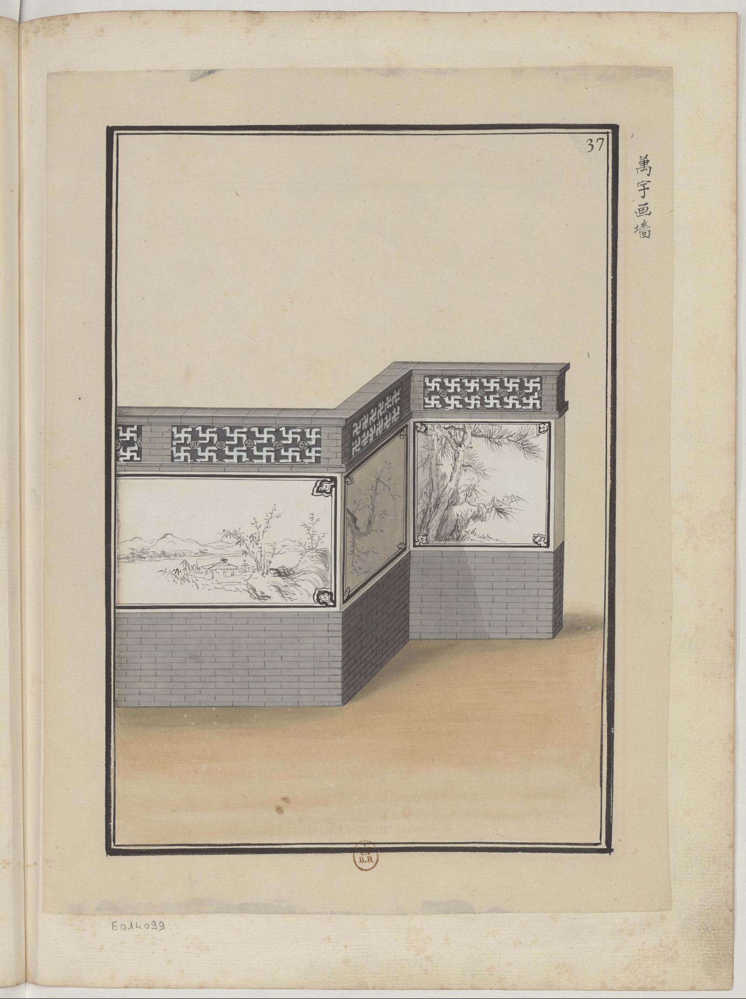

<h2 align="right">The City Wall (城墻) <a href="../README.md">Back</a></h2>

<table>
    <tr>
        <td align="center">
Walls around farms

菜圃子土墻
</td>
        <td align="center">
Folk grey walls

民間灰墻
</td>
        <td align="center">
Walls around gardens constructed with tiger's eye

虎皮石花園墻
</td>
        <td align="center">
Walls around rivers constructed with bricks

河沿兒上磚墻
</td>
    </tr>
    <tr>
        <td align="center"></td>
        <td align="center"></td>
        <td align="center"></td>
        <td align="center"></td>
    </tr>
    <tr>
        <td align="center">
Ancient city walls

古城墻
</td>
        <td align="center">
Walls around gardens of counts and princes

公爺家園子外圍墻
</td>
        <td align="center">
Walls around Lama Temple

喇嘛廟圍墻
</td>
        <td align="center">
Royal family walls

皇上家墻
</td>
    </tr>
    <tr>
        <td align="center"></td>
        <td align="center"></td>
        <td align="center"></td>
        <td align="center"></td>
    </tr>
    <tr>
        <td align="center">
Royal city walls

皇城大墻
</td>
        <td align="center">
Tracery walls

花欄墻
</td>
        <td align="center">
Tracery walls constructed with carvings

雕刻花墻
</td>
        <td align="center">
Tracery walls drawn with landscapes

萬宇畫墻
</td>
    </tr>
    <tr>
        <td align="center"></td>
        <td align="center"></td>
        <td align="center"></td>
        <td align="center"></td>
    </tr>
    <tr>
        <td align="center">
Walls around mausoleums

墳院外墙
</td>
        <td align="center">
Tracery walls constructed with chiseled bricks

鑿磚花墻
</td>
        <td align="center">
Rectangular tracery walls

轉角花墻
</td>
        <td align="center">
Circuitous tracery walls

曲折花墻
</td>
    </tr>
    <tr>
        <td align="center"></td>
        <td align="center"></td>
        <td align="center"></td>
        <td align="center"></td>
    </tr>
</table>
